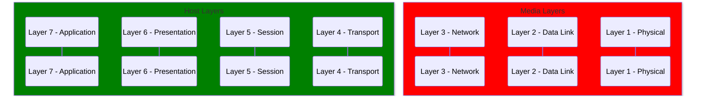

The OSI (Open Systems Interconnection) model is a conceptual framework that describes the communication functions of a telecommunication or computer system. 
The model is divided into seven layers, each of which performs a specific function in the transmission of data between networked devices. 
These layers are designed to provide a standardized approach to network communication, allowing different types of devices to communicate with each other regardless of their underlying hardware or software. 
By understanding the functions of each layer in the OSI model, network engineers and IT professionals can design, implement, and troubleshoot complex networks more efficiently and effectively.

