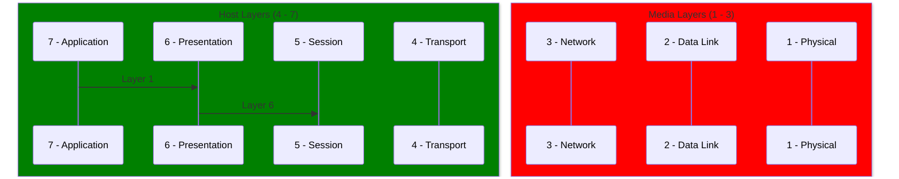

# 7 Layer OSI Model

The OSI (Open Systems Interconnection) model is a conceptual framework that describes the communication functions of a telecommunication or computer system. 
The model is divided into seven layers, each of which performs a specific function in the transmission of data between networked devices. 
These layers are designed to provide a standardized approach to network communication, allowing different types of devices to communicate with each other regardless of their underlying hardware or software. 
By understanding the functions of each layer in the OSI model, network engineers and IT professionals can design, implement, and troubleshoot complex networks more efficiently and effectively.

## Layer x
A device of any layer contains the logic and has to capability to perform functions of the layers below it.
For example, a layer 3 device can perform the functions of the layer 1, 2 and 3 but not of 4.

## Layer 1 - Physical
### Defintion
The physical medium that is used to transmit unstructure information (ex. between interface cards); these can be copper (electrical), fibre (light) or wifi (RF). 
This is a broadcast medium: no address targetting, all data is processed by all devices

### Standards & Specifications
Physical layer specifications define the transmission and reception of raw bit streams between a device and a shared physical medium. It defines things like voltage levels, timing, rates, distances, modulation and connectors. 
Generally, this means a certain kind of network card and cable or wifi cards using a certain kind of antenna and frequency ranges.

> #### Copper Cables
> Specifications for copper cables will define a certain voltage as Binary 1 and another voltage as Binary 0 thus allowing two interface cards to transmit a stream of 1s and 0s as information amongst each other.

### Issues
 - No access control
 - No uniquely identified devices
 - No collion detection.
     - If multiple devices transit at once - a collion occurs.

One broadcast and one collion domain so they tend not to scale very well.
The more devices that are added to layer 1, the higher the chance of collions and data corruption.
